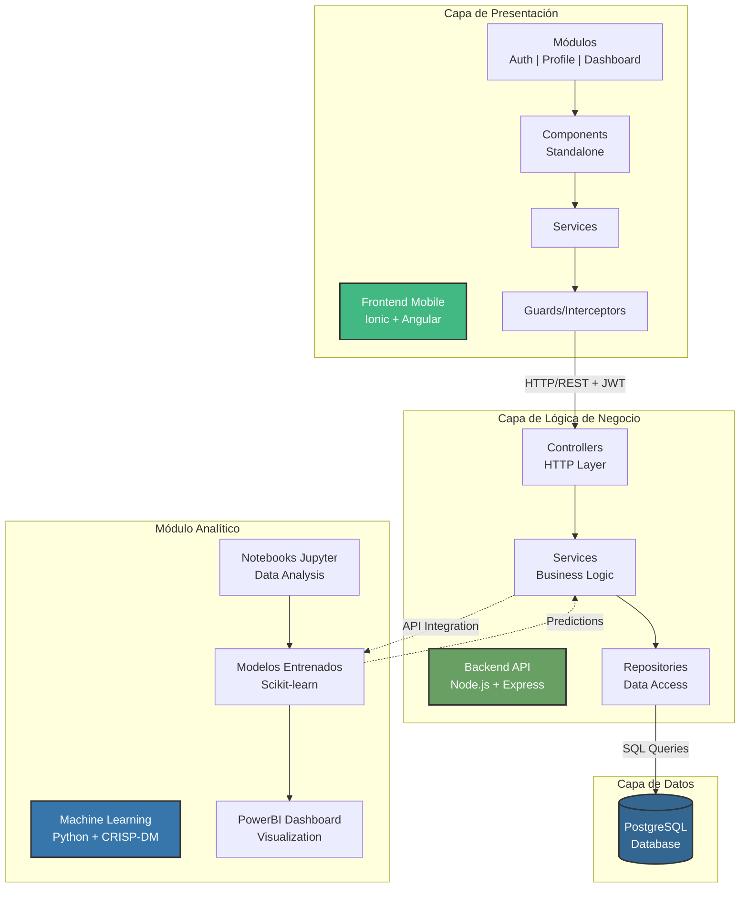
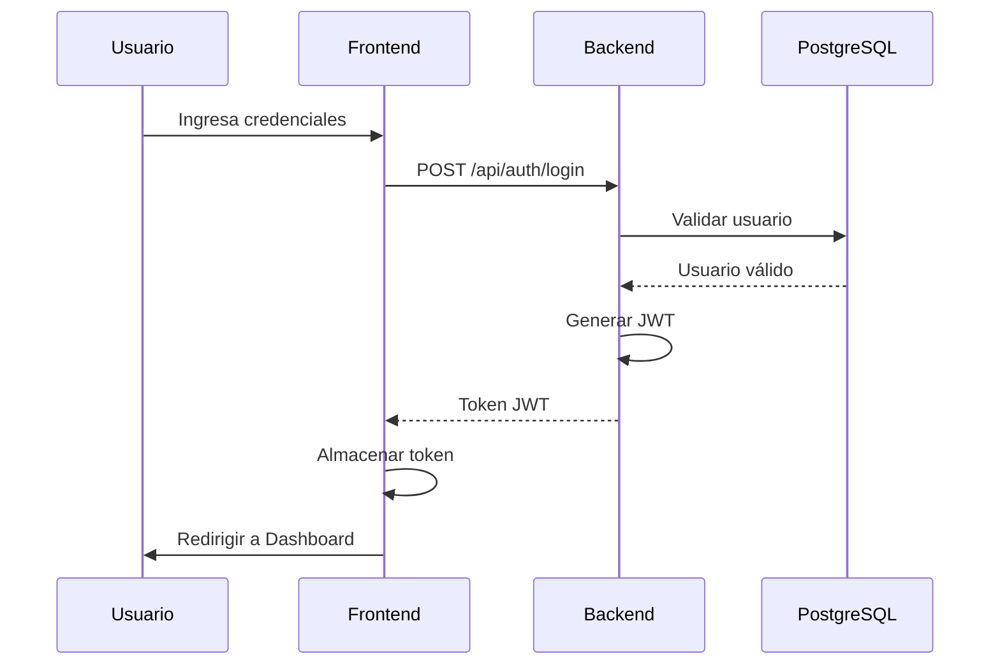
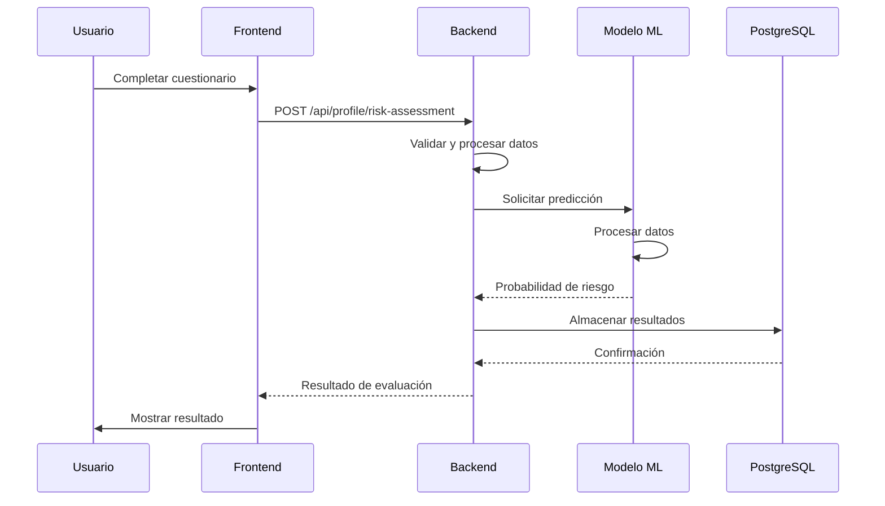
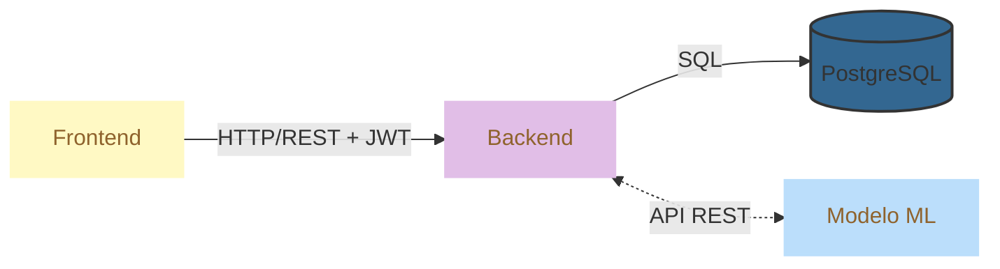

# Arquitectura del Sistema LungLife

## Descripción General

LungLife implementa una **arquitectura 3-Tier con módulo de Machine Learning** que separa claramente las responsabilidades del sistema en capas independientes y desacopladas. Esta arquitectura permite escalabilidad, mantenibilidad y evolución independiente de cada componente, siguiendo los principios de Clean Architecture en el backend para garantizar la separación de responsabilidades y facilitar las pruebas unitarias.

## Diagrama de Arquitectura

## Especificaciones por Capa

### Resumen por Capas

| Capa                  | Tecnologías Principales                         | Responsabilidades                                                                                                                                     | Comunicación                                           |
| --------------------- | ----------------------------------------------- | ----------------------------------------------------------------------------------------------------------------------------------------------------- | ------------------------------------------------------ |
| **Presentación**      | Ionic Framework, Angular (TypeScript), SCSS     | Interfaz de usuario multiplataforma (iOS/Android/Web), validación de formularios, gestión de estado, navegación                                       | HTTP/HTTPS con autenticación JWT hacia capa de negocio |
| **Lógica de Negocio** | Node.js, Express, TypeScript, PostgreSQL driver | Procesamiento de reglas de negocio, autenticación/autorización, evaluación de riesgo, orquestación de servicios, auditoría                            | SQL hacia capa de datos, REST API hacia módulo ML      |
| **Datos**             | PostgreSQL 14+                                  | Persistencia de datos, integridad referencial, almacenamiento de perfiles de usuario, resultados de evaluaciones, logs de auditoría                   | Consultas SQL desde repositorios de la capa de negocio |
| **Machine Learning**  | Python, Scikit-learn, Pandas, Jupyter, PowerBI  | Análisis exploratorio de datos, entrenamiento de modelos predictivos, generación de predicciones, dashboards analíticos mediante metodología CRISP-DM | API REST para predicciones en tiempo real              |

### 1. Capa de Presentación

**Tecnologías:**

- Framework: Ionic Framework con Angular Standalone Components
- Lenguaje: TypeScript
- Estilos: SCSS con sistema de temas personalizado
- Patrón: MVVM (Model-View-ViewModel)

**Responsabilidades:**

- Interfaz de usuario móvil multiplataforma (iOS, Android, Web)
- Gestión de estado de la aplicación
- Validación de formularios del lado del cliente
- Navegación y enrutamiento
- Consumo de servicios REST del backend

**Comunicación:**

- Protocolo: HTTP/HTTPS
- Formato: JSON
- Autenticación: JWT Bearer Token

### 2. Capa de Lógica de Negocio

**Tecnologías:**

- Runtime: Node.js
- Framework: Express.js
- Lenguaje: TypeScript
- Base de Datos: PostgreSQL (driver pg)
- Autenticación: JWT (jsonwebtoken)

**Patrón Arquitectónico:**
Clean Architecture con separación en subcapas:

#### 2.1 Controllers (Capa de Presentación)

- Manejo de solicitudes HTTP
- Validación de entrada
- Serialización de respuestas
- Documentación Swagger

#### 2.2 Services (Capa de Aplicación)

- Lógica de negocio
- Orquestación de operaciones
- Gestión de transacciones
- Validaciones de dominio

#### 2.3 Repositories (Capa de Infraestructura)

- Acceso a datos
- Implementación del patrón Repository
- Abstracción de la base de datos
- Unit of Work para transacciones

**Responsabilidades:**

- Procesamiento de reglas de negocio
- Autenticación y autorización
- Gestión de perfiles de usuario
- Evaluación de riesgo
- Integración con módulo de ML
- Logs de auditoría

### 3. Capa de Datos

**Tecnología:**

- Sistema: PostgreSQL
- Versión: Compatible con 14+
- Esquema: Relacional normalizado

**Características:**

- Migraciones SQL versionadas
- Integridad referencial
- Índices optimizados
- Stored procedures (cuando sea necesario)
- Triggers para auditoría

**Esquemas Principales:**

- Autenticación (usuarios, sesiones, 2FA)
- Perfiles de usuario
- Evaluación de riesgo
- Logs de auditoría

**Responsabilidades:**

- Persistencia de datos
- Integridad de datos
- Consultas optimizadas
- Backups y recuperación

### 4. Módulo de Machine Learning

**Metodología:**

- Framework: CRISP-DM (Cross Industry Standard Process for Data Mining)

**Tecnologías:**

- Lenguaje: Python 3.x
- Notebooks: Jupyter
- Bibliotecas: Scikit-learn, Pandas, NumPy
- Visualización: Matplotlib, Seaborn, PowerBI

**Fases CRISP-DM:**

1. **Business Understanding**: Comprensión del problema de predicción de cáncer pulmonar
2. **Data Understanding**: Análisis exploratorio de datos epidemiológicos
3. **Data Preparation**: Limpieza y transformación de datos
4. **Modeling**: Entrenamiento de modelos predictivos
5. **Evaluation**: Validación y métricas de rendimiento
6. **Deployment**: Integración con backend vía API

**Responsabilidades:**

- Análisis exploratorio de datos
- Entrenamiento de modelos predictivos
- Generación de predicciones
- Dashboards analíticos en PowerBI
- Actualización continua de modelos

**Integración:**

- API REST para predicciones en tiempo real
- Batch processing para análisis masivos
- Versionamiento de modelos

## Flujos de Comunicación

| Flujo                    | Capas Involucradas                            | Descripción del Proceso                                                                                                                                                                                                                                                                                        |
| ------------------------ | --------------------------------------------- | -------------------------------------------------------------------------------------------------------------------------------------------------------------------------------------------------------------------------------------------------------------------------------------------------------------- |
| **Autenticación**        | Presentación → Lógica de Negocio → Datos      | 1. Usuario ingresa credenciales en Frontend 2. Frontend envía POST a `/api/auth/login` 3. Backend valida contra PostgreSQL 4. Backend genera JWT token 5. Frontend almacena token y redirige al dashboard                                                                                      |
| **Evaluación de Riesgo** | Presentación → Lógica de Negocio → Datos → ML | 1. Usuario completa cuestionario en Frontend 2. Frontend envía datos a `/api/profile/risk-assessment` 3. Backend procesa datos en Services 4. Backend consulta modelo ML para predicción (opcional) 5. Backend almacena resultados en PostgreSQL 6. Frontend muestra resultados al usuario |
| **Predicción ML**        | Lógica de Negocio ↔ Machine Learning          | 1. Backend solicita predicción al módulo ML 2. Modelo ML procesa datos de entrada 3. Modelo ML retorna probabilidad de riesgo 4. Backend integra resultado en respuesta al frontend                                                                                                                |

### Diagramas de Secuencia

#### Flujo de Autenticación

#### Flujo de Evaluación de Riesgo con ML

#### Flujo Simplificado de Comunicación entre Capas

## Ventajas de la Arquitectura

### Separación de Responsabilidades

- Cada capa tiene un propósito específico y bien definido
- Facilita el mantenimiento y desarrollo de pruebas
- Código organizado y fácil de entender para presentaciones

### Escalabilidad (Diseño Preparado)

- Arquitectura permite crecimiento futuro si se requiere
- Separación de capas facilita optimizaciones independientes
- Base sólida para evolución post-MVP

### Mantenibilidad

- Clean Architecture facilita cambios y extensiones
- Bajo acoplamiento entre capas
- Alta cohesión dentro de cada componente
- Ideal para iteraciones y mejoras incrementales

### Testabilidad

- Pruebas unitarias por capa implementadas
- Mocking de dependencias facilitado por la arquitectura
- Cobertura de código en componentes críticos

### Demostración de Buenas Prácticas

- Implementación de patrones de diseño estándar de la industria
- Código limpio y bien documentado
- Arquitectura profesional apta para presentación académica

## Atributos de Calidad del Software

Los siguientes atributos de calidad han sido considerados como alcances iniciales del proyecto, estableciendo las bases para un sistema robusto y profesional:

### Mantenibilidad

**Objetivo**: Facilitar la evolución y modificación del sistema a lo largo del tiempo.

- **Modularidad**: Arquitectura modular con feature modules independientes (Auth, Profile, Dashboard, Security)
- **Clean Code**: Convenciones de nomenclatura consistentes siguiendo estándares de TypeScript/Angular
- **Documentación**: 
  - README completo en cada módulo
  - Comentarios en código para lógica compleja
  - Documentación de API con Swagger
  - Diagramas de arquitectura actualizados

**Beneficio**: Reduce el tiempo de onboarding de nuevos desarrolladores y facilita el mantenimiento correctivo y evolutivo.

### Usabilidad

**Objetivo**: Garantizar una experiencia de usuario intuitiva y accesible.

- **Responsive Design**: Diseño mobile-first con soporte cross-platform (iOS, Android, Web)
- **UI Consistency**: Sistema de diseño unificado usando Ionic Components
- **User Feedback**: 
  - Estados de carga claros
  - Mensajes de error descriptivos
  - Notificaciones toast para acciones
  - Validación en tiempo real de formularios

**Beneficio**: Mejora la adopción del usuario y reduce la curva de aprendizaje de la aplicación.

### Escalabilidad

**Objetivo**: Diseñar el sistema para soportar crecimiento futuro en usuarios y funcionalidades.

- **Layered Architecture**: Separación clara de responsabilidades en 3 capas principales
- **Dependency Injection**: Inyección de dependencias para testing y flexibilidad en toda la aplicación
- **Microservices Ready**: Arquitectura preparada para migración a microservicios si es necesario
- **Stateless Backend**: API sin estado permite replicación horizontal

**Beneficio**: Permite evolucionar el sistema según las necesidades sin reescritura completa.

### Confiabilidad

**Objetivo**: Asegurar que el sistema funcione correctamente bajo condiciones esperadas.

- **Error Handling**: 
  - Manejo robusto de errores en todas las capas
  - Try-catch en operaciones críticas
  - Respuestas HTTP estandarizadas
- **Logging**: 
  - Sistema de logging estructurado
  - Registro de operaciones críticas
  - Trazabilidad de errores
- **Testing**: 
  - Tests unitarios en servicios y controladores
  - Tests de integración en endpoints críticos
  - Cobertura mínima definida por módulo

**Beneficio**: Reduce fallos en producción y facilita la identificación y resolución de problemas.

### Seguridad

**Objetivo**: Proteger la información del usuario y prevenir accesos no autorizados.

- **Autenticación**: JWT con tokens de corta duración
- **Autorización**: Verificación de permisos en cada endpoint
- **Validación**: Entrada validada en frontend y backend
- **Encriptación**: Contraseñas hasheadas con bcrypt
- **HTTPS**: Comunicación encriptada

**Beneficio**: Cumple con estándares básicos de seguridad para aplicaciones de salud.

### Rendimiento

**Objetivo**: Garantizar tiempos de respuesta aceptables para el usuario.

- **Optimización de Consultas**: Índices en base de datos para búsquedas frecuentes
- **Lazy Loading**: Carga perezosa de módulos en frontend
- **Connection Pooling**: Pool de conexiones a base de datos
- **Caché**: Estrategias de caché en frontend para datos estáticos

**Beneficio**: Mejora la experiencia del usuario con tiempos de respuesta rápidos.

## Consideraciones de Seguridad

- **Autenticación**: JWT con refresh tokens
- **Autorización**: Control de acceso basado en roles
- **Encriptación**: HTTPS para todas las comunicaciones
- **Validación**: Entrada validada en múltiples capas
- **Auditoría**: Logs completos de operaciones sensibles
- **CORS**: Configurado para dominios específicos
- **Rate Limiting**: Protección contra ataques de fuerza bruta

## Tecnologías Utilizadas

### Frontend

- Ionic Framework 7+
- Angular 17+ (Standalone Components)
- TypeScript 5+
- SCSS
- Capacitor (para compilación nativa)

### Backend

- Node.js 18+
- Express.js 4+
- TypeScript 5+
- PostgreSQL driver (pg)
- JWT (jsonwebtoken)
- Bcrypt (encriptación)

### Base de Datos

- PostgreSQL 14+

### Machine Learning

- Python 3.10+
- Jupyter Notebook
- Pandas, NumPy
- Scikit-learn
- Matplotlib, Seaborn
- PowerBI Desktop

## Alcance del Proyecto

### Estado Actual: MVP para Presentación Capstone

Este proyecto es un **Minimum Viable Product (MVP)** desarrollado como demostración técnica para el proyecto Capstone PTY4614. La arquitectura implementada demuestra:

- Aplicación completa de principios de Clean Architecture
- Integración funcional de las 3 capas principales
- Fundamentos de Machine Learning aplicado a salud
- Implementación de buenas prácticas de desarrollo

### Limitaciones del MVP

- **Despliegue**: Ambiente local de desarrollo
- **Base de Datos**: PostgreSQL local sin replicación
- **Usuarios**: Diseñado para demostración, no para producción masiva
- **ML**: Modelos en fase exploratoria y experimental
- **Infraestructura**: Sin containerización ni orquestación

### Posibles Evoluciones Futuras

Si el proyecto continuara más allá del Capstone, se podrían considerar:

- Containerización con Docker para facilitar deployment
- Implementación de CI/CD para automatización
- Mejoras en modelos de ML con datasets más robustos
- Optimización de rendimiento y cache
- Integración de servicios cloud (AWS, Azure, GCP)
- Implementación de monitoreo y observabilidad

**Nota**: Estas evoluciones están fuera del alcance actual del proyecto académico.
