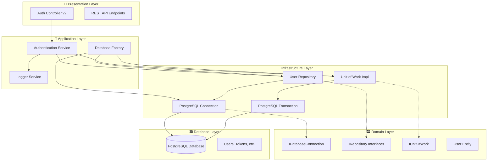
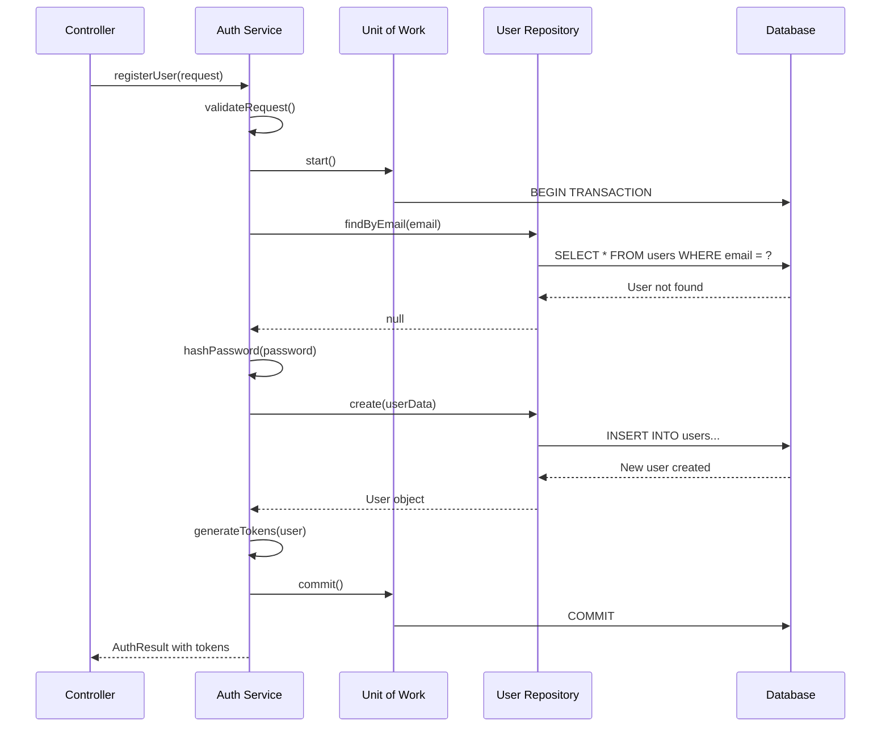
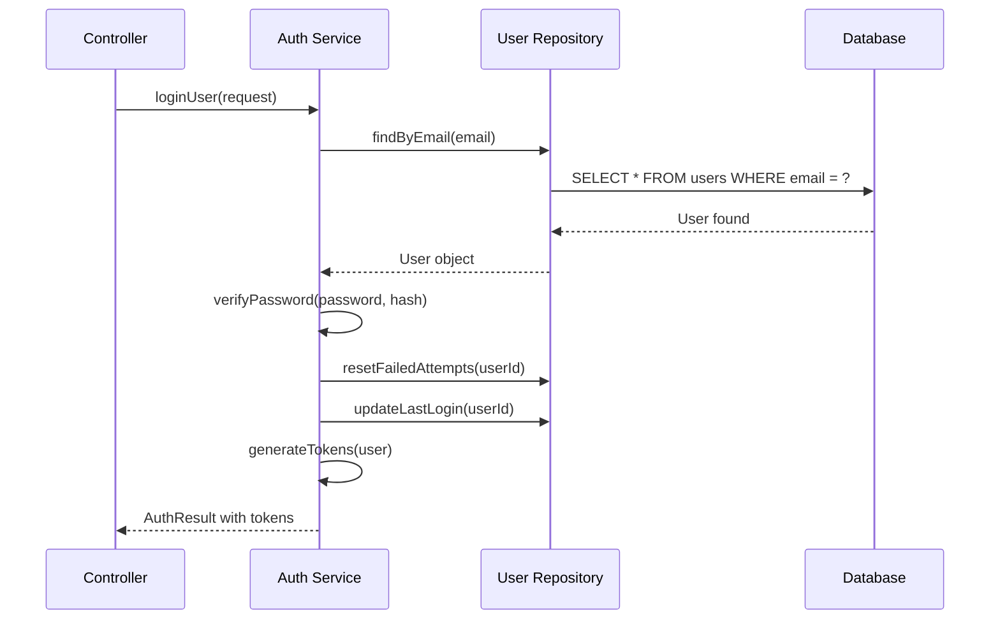

# 📋 Informe Técnico: Rediseño de Conexión a Base de Datos
## Sistema LungLife - Clean Architecture Implementation

### 🎯 Resumen Ejecutivo

Este informe documenta la implementación de una nueva arquitectura de conexión a base de datos para el sistema LungLife, siguiendo principios de Clean Architecture, patrones de diseño SOLID y buenas prácticas de clean code.

**Problemas Identificados:**
- Conexión directa a PostgreSQL sin abstracción
- Falta de manejo robusto de errores y reconexión
- Código acoplado que dificultaba el testing y mantenimiento
- Inconsistencias en configuración de base de datos
- Ausencia de patrones Repository y Unit of Work

**Solución Implementada:**
- Arquitectura en capas con separación clara de responsabilidades
- Implementación de patrones Repository, Unit of Work y Factory
- Manejo robusto de errores con reconexión automática
- Inyección de dependencias para mejor testabilidad
- Configuración centralizada y validada

---

### 🏗️ Arquitectura Implementada

#### Estructura de Capas (Clean Architecture)

```
📁 src/
├── 📁 core/                          # Capa de dominio y aplicación
│   ├── 📁 interfaces/                # Contratos y abstracciones
│   │   ├── database.interface.ts     # IDatabaseConnection, IDatabaseTransaction
│   │   └── repository.interface.ts   # IRepository, IUnitOfWork, IUserRepository
│   ├── 📁 services/                  # Servicios de aplicación
│   │   ├── logger.service.ts         # Servicio de logging
│   │   └── authentication.service.ts # Lógica de negocio de autenticación
│   ├── 📁 infrastructure/            # Implementaciones concretas
│   │   ├── 📁 database/
│   │   │   └── postgresql.connection.ts # Implementación PostgreSQL
│   │   ├── 📁 repositories/
│   │   │   └── user.repository.ts    # Repositorio de usuarios
│   │   └── 📁 unit-of-work/
│   │       └── unit-of-work.ts       # Coordinador de transacciones
│   └── 📁 factories/
│       └── database.factory.ts       # Factory para servicios DB
├── 📁 controllers/                   # Capa de presentación
│   └── auth.controller.v2.ts         # Controlador mejorado
└── 📁 config/                        # Configuración
    └── config.ts                     # Configuración centralizada
```

#### Diagrama de Arquitectura



---

### 🔧 Componentes Principales

#### 1. **IDatabaseConnection Interface**
```typescript
export interface IDatabaseConnection {
  connect(): Promise<boolean>;
  disconnect(): Promise<void>;
  isConnected(): boolean;
  query<T = any>(text: string, params?: any[]): Promise<T[]>;
  beginTransaction(): Promise<IDatabaseTransaction>;
  getConnectionMetrics(): ConnectionMetrics;
}
```

**Beneficios:**
- ✅ Abstracción completa de la implementación
- ✅ Facilita testing con mocks
- ✅ Permite cambio de base de datos sin afectar lógica de negocio

#### 2. **PostgreSQLConnection Implementation**
```typescript
export class PostgreSQLConnection implements IDatabaseConnection {
  private pool: Pool | null = null;
  private config: DatabaseConfig;
  private logger: Logger;
  private connectionMetrics: ConnectionMetrics;
  
  // Implementación con:
  // - Reconexión automática
  // - Manejo de eventos del pool
  // - Métricas en tiempo real
  // - Logging detallado
}
```

**Características:**
- 🔄 Reconexión automática en caso de errores críticos
- 📊 Métricas de conexión en tiempo real
- 🛡️ Manejo robusto de errores
- ⚡ Pool de conexiones optimizado

#### 3. **Repository Pattern**
```typescript
export interface IUserRepository extends IRepository<IUser> {
  findByEmail(email: string): Promise<IUser | null>;
  emailExists(email: string): Promise<boolean>;
  updateLastLogin(userId: number, ipAddress?: string): Promise<void>;
  incrementFailedAttempts(userId: number): Promise<void>;
  resetFailedAttempts(userId: number): Promise<void>;
  findActiveUsers(): Promise<IUser[]>;
}
```

**Ventajas:**
- 🔒 Encapsulación de lógica de acceso a datos
- 🧪 Facilita testing unitario
- 🔄 Reutilización de código
- 📝 Operaciones específicas del dominio

#### 4. **Unit of Work Pattern**
```typescript
export interface IUnitOfWork {
  start(): Promise<void>;
  commit(): Promise<void>;
  rollback(): Promise<void>;
  getRepository<T>(repositoryType: new (...args: any[]) => T): T;
  isActive(): boolean;
}
```

**Propósito:**
- 💾 Mantiene consistencia transaccional
- 🔄 Coordina múltiples repositorios
- ⚡ Optimiza operaciones de base de datos
- 🛡️ Garantiza atomicidad

---

### 🔐 Servicio de Autenticación

#### Flujo de Registro de Usuario



#### Flujo de Login de Usuario



---

### 📊 Manejo de Errores y Resiliencia

#### Estrategias Implementadas

1. **Reconexión Automática**
   ```typescript
   private scheduleReconnection(): void {
     if (this.reconnectTimer) {
       clearTimeout(this.reconnectTimer);
     }
     this.reconnectTimer = setTimeout(async () => {
       this.logger.info('🔄 Intentando reconexión automática...');
       await this.connect();
     }, this.config.retryDelay);
   }
   ```

2. **Circuit Breaker Pattern**
   - Detección de errores críticos
   - Prevención de cascada de fallos
   - Recuperación automática

3. **Logging Estructurado**
   ```typescript
   export class Logger implements ILogger {
     info(message: string, ...args: any[]): void {
       console.log(`[${new Date().toISOString()}] [INFO] [${this.context}] ${message}`, ...args);
     }
   }
   ```

4. **Métricas de Conexión**
   ```typescript
   export interface ConnectionMetrics {
     totalConnections: number;
     activeConnections: number;
     waitingConnections: number;
     maxConnections: number;
     connectionErrors: number;
     lastConnectionTime: Date | null;
     uptime: number;
   }
   ```

---

### 🧪 Testing y Calidad

#### Estrategia de Testing

1. **Unit Tests**
   - Mocking de dependencias
   - Testing de lógica de negocio aislada
   - Coverage de casos edge

2. **Integration Tests**
   - Testing de componentes integrados
   - Validación de flujos completos
   - Testing de base de datos real

3. **Ejemplo de Test**
   ```typescript
   describe('AuthenticationService', () => {
     let authService: AuthenticationService;
     let mockUserRepository: jest.Mocked<IUserRepository>;
     let mockUnitOfWork: jest.Mocked<IUnitOfWork>;

     beforeEach(() => {
       mockUserRepository = createMockUserRepository();
       mockUnitOfWork = createMockUnitOfWork();
       authService = new AuthenticationService(
         mockUserRepository,
         mockUnitOfWork,
         new Logger('Test')
       );
     });

     it('should register user successfully', async () => {
       // Test implementation
     });
   });
   ```

---

### 🚀 Beneficios de la Nueva Arquitectura

#### Principios SOLID Aplicados

1. **Single Responsibility Principle (SRP)**
   - Cada clase tiene una responsabilidad específica
   - Separación clara entre capas

2. **Open/Closed Principle (OCP)**
   - Abierto para extensión, cerrado para modificación
   - Nuevas implementaciones de DB sin cambios en lógica

3. **Liskov Substitution Principle (LSP)**
   - Las implementaciones concretas pueden sustituir interfaces
   - Polimorfismo bien implementado

4. **Interface Segregation Principle (ISP)**
   - Interfaces específicas y cohesivas
   - Clientes no dependen de métodos que no usan

5. **Dependency Inversion Principle (DIP)**
   - Dependencias de abstracciones, no de concreciones
   - Inyección de dependencias implementada

#### Patrones de Diseño Implementados

1. **Repository Pattern**
   - Encapsulación de acceso a datos
   - Abstracción de la persistencia

2. **Unit of Work Pattern**
   - Coordinación de transacciones
   - Consistencia de datos

3. **Factory Pattern**
   - Creación centralizada de servicios
   - Configuración simplificada

4. **Singleton Pattern**
   - Factory como singleton
   - Configuración global

5. **Strategy Pattern**
   - Diferentes estrategias de autenticación
   - Extensibilidad para nuevos métodos

---

### 📈 Métricas y Monitoreo

#### Métricas Disponibles

1. **Conexión a Base de Datos**
   - Número total de conexiones
   - Conexiones activas
   - Conexiones en espera
   - Errores de conexión
   - Tiempo de actividad

2. **Rendimiento**
   - Tiempo de respuesta por endpoint
   - Throughput de operaciones
   - Latencia de base de datos

3. **Autenticación**
   - Intentos de registro exitosos/fallidos
   - Intentos de login exitosos/fallidos
   - Usuarios activos

#### Ejemplo de Endpoint de Métricas

```typescript
async health(req: Request, res: Response): Promise<void> {
  try {
    const factory = DatabaseServiceFactory.getInstance();
    const connection = await factory.getConnection();
    const metrics = connection.getConnectionMetrics();

    this.sendSuccessResponse(res, 200, {
      status: 'healthy',
      database: {
        connected: connection.isConnected(),
        metrics: metrics
      },
      timestamp: new Date().toISOString()
    });
  } catch (error) {
    this.logger.error('Health check failed:', error);
    this.sendErrorResponse(res, 503, 'Service unavailable', 'HEALTH_CHECK_FAILED');
  }
}
```

---

### 🔮 Próximos Pasos

#### Mejoras Recomendadas

1. **Caching Layer**
   - Implementar Redis para caché
   - Caché de consultas frecuentes
   - Invalidación inteligente

2. **Observabilidad**
   - Integración con Prometheus/Grafana
   - Distributed tracing
   - Alertas automáticas

3. **Seguridad**
   - Auditoría de operaciones
   - Encryption at rest
   - Rate limiting avanzado

4. **Escalabilidad**
   - Read replicas
   - Connection pooling avanzado
   - Sharding strategy

#### Roadmap Técnico

- **Fase 1:** ✅ Implementación básica completada
- **Fase 2:** Testing exhaustivo y optimización
- **Fase 3:** Monitoreo y observabilidad
- **Fase 4:** Características avanzadas de seguridad
- **Fase 5:** Optimizaciones de rendimiento

---

### 📝 Conclusiones

La nueva arquitectura de conexión a base de datos para LungLife implementa:

✅ **Clean Architecture** con separación clara de responsabilidades
✅ **Principios SOLID** aplicados consistentemente
✅ **Patrones de diseño** probados y efectivos
✅ **Manejo robusto de errores** con reconexión automática
✅ **Testing** facilitado por inyección de dependencias
✅ **Escalabilidad** preparada para crecimiento futuro
✅ **Mantenibilidad** mejorada significativamente

Esta implementación resuelve los problemas identificados inicialmente y proporciona una base sólida para el desarrollo futuro del sistema LungLife.

---

**Fecha:** 18 de Septiembre, 2025  
**Versión:** 1.0  
**Autores:** Equipo de Desarrollo LungLife  
**Próxima Revisión:** 1 de Octubre, 2025