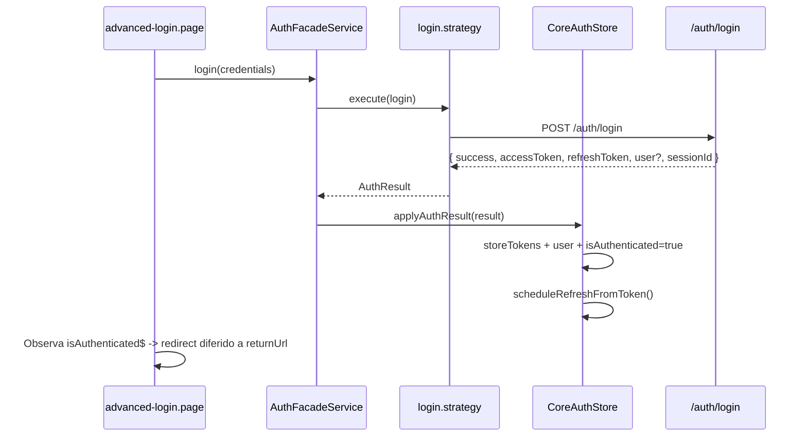
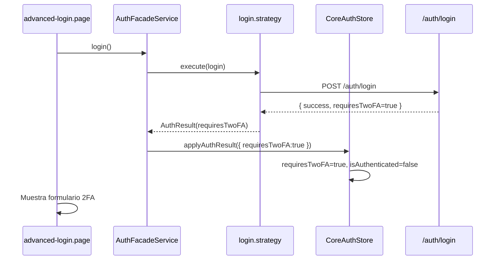
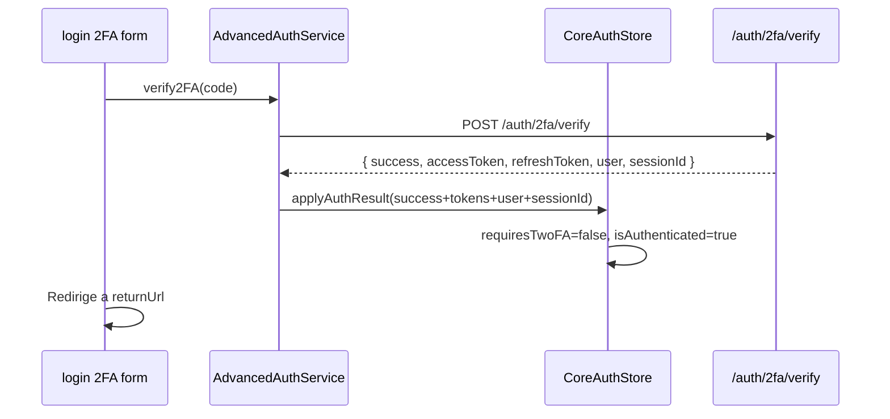
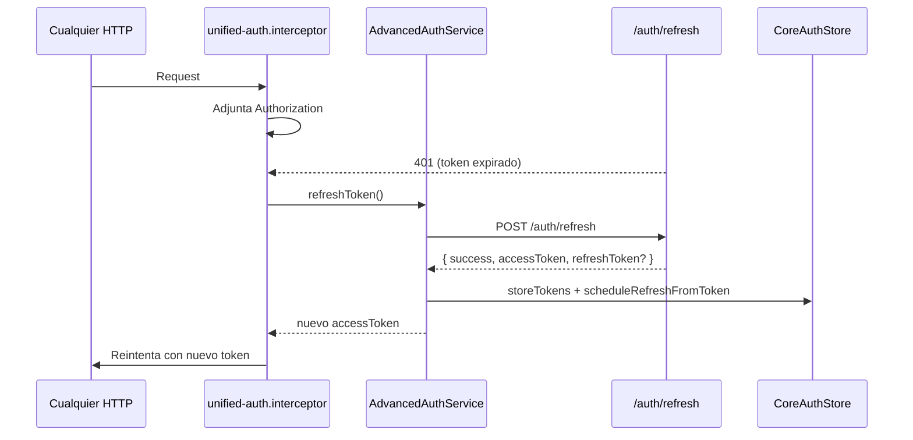
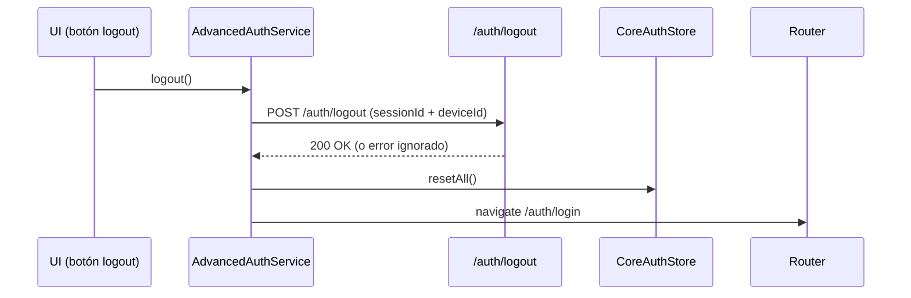
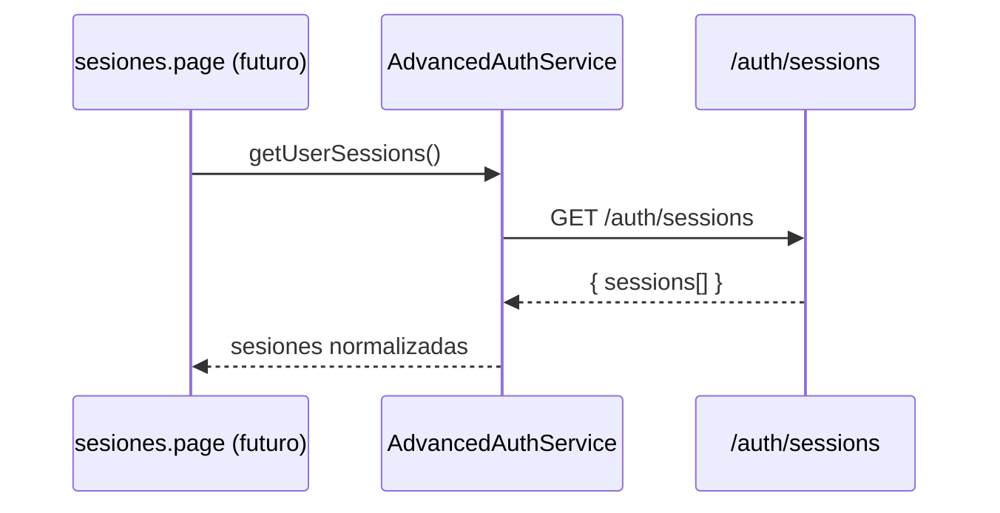
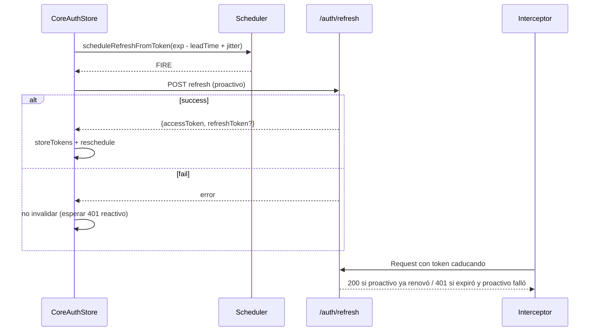

# Mapeo de Flujos de Autenticación (Estado Actual Post Refactor Parcial)

> Fecha: 2025-09-29  
> Estado Base: CoreAuthStore activo, AdvancedAuthService delegado, Unified Interceptor y Guards unificados implementados.

---
## 1. Componentes Clave

| Componente | Rol | Observaciones |
|------------|-----|---------------|
| CoreAuthStore | Fuente única de estado (user, isAuthenticated, requiresTwoFA, tokens, sessionId, scheduler) | No navega, API síncrona para guards/interceptor |
| AuthFacadeService | Orquesta estrategias (login/register/2FA/forgot/google). Convierte `AuthResult` → `applyAuthResult` | `syncFromAdvanced` en vías de desaparición (ya no usado) |
| AdvancedAuthService | Transicional: encapsula endpoints avanzados (sesiones, logout remoto, 2FA setup/verify) | Ya no mantiene estado propio; delega al store |
| Estrategias (login, register, two-factor, google, forgot-password) | Devuelven `AuthResult` puro (sin mutar tokens directamente) | Facade traduce al store |
| unified-auth.interceptor | Adjunta token, maneja cola de refresh ante 401, dispara refreshToken en AdvancedAuthService | Próximo paso: mover refresh proactivo al store/interceptor |
| Guards unificados | Auth / Guest / (futuro) 2FA pendiente | Usan API síncrona del store |
| auth-navigation utils | `resolvePostAuthRedirect(returnUrl)` con allowlist | Centraliza sanitización |

---
## 2. Flujo: Bootstrap de Sesión (Cold Start / Reload)

```mermaid
description: Boot sequence
sequenceDiagram
  participant APP as APP_INIT (APP_INITIALIZER)
  participant Store as CoreAuthStore
  participant API as /auth/me

  APP->>Store: bootstrapSession()
  Store->>Store: Lee accessToken localStorage
  alt No token
    Store->>Store: resetAll()
  else Token existe
    Store->>API: GET /auth/me
    alt success + user
      API-->>Store: user
      Store->>Store: set user + isAuthenticated=true
      Store->>Store: scheduleRefreshFromToken()
    else error / user null
      API-->>Store: error
      Store->>Store: resetAll()
    end
  end
```

Estado resultante:
- `isAuthenticated=true` sólo si `/auth/me` retorna usuario válido.
- No navegación automática (guard lo hace al intentar entrar a rutas protegidas).

Riesgos / Notas:
- Si `/auth/me` demora mucho, primeras rutas protegidas podrían esperar (OK porque guard mira estado sincronizado).
- Falta distinción explícita entre “loading bootstrap” y “idle”. (Opcional añadir flag futuro.)

---
## 3. Flujo: Login (Sin 2FA)



Notas:
- Si `user` no viene, `AdvancedAuthService` (cuando usado) hace fallback a `/auth/me` (actualmente aún implementado en su propio login path transicional).

---
## 4. Flujo: Login (Con 2FA Requerido)



Pendiente de mejora:
- Flag único `requiresTwoFA` se usa tanto para “pendiente de verificación” como estado guard. Podríamos separar `twoFA.pending` vs `twoFA.enrolled`.

---
## 5. Flujo: Verificación 2FA



---
## 6. Flujo: Refresh de Token (Actual)

Evento disparador: 401 en una request protegida.



Limitaciones actuales:
- Refresh sólo reactivo (no proactivo aunque existe scheduler pasivo en Store que hoy es un noop informativo).
- Si refresh falla → logout inmediato.
- Falta backoff / retry controlado.

Objetivos futuros (Tarea 17):
- Scheduler proactivo (llamar refresh X minutos antes con jitter real).
- Cancelar scheduler al logout / cambio de usuario.
- Política: 1 reintento silencioso si error de red transitorio.
- Invalidar tokens sólo tras confirmación de fallo fatal.

---
## 7. Flujo: Logout



Fallback: Si API falla, se hace igualmente `resetAll()`.

---
## 8. Flujo: ReturnUrl / Post Auth Redirect

1. Guard de ruta protegida detecta no autenticado → redirige a `/auth/login?returnUrl=/ruta/original` sanitizada.
2. Al completar login / 2FA el componente intenta redirigir a `returnUrl` (con reintentos escalonados para evitar condición de carrera inicial si el estado todavía se propaga asíncronamente en borde).
3. Si `returnUrl` inválida → fallback a `DEFAULT_AUTH_REDIRECT`.

Mejoras futuras:
- Registrar última ruta interna válida antes de forzar login (para volver exactamente ahí sin depender de query param si usuario borra param manualmente).

---
## 9. Flujo: Gestión de Sesiones Activas



Revocación:
- UI llama `revokeSession({sessionId})` o `{revokeAll:true}`.
- Si la sesión revocada es la actual → se dispara logout (resetAll + navigate login).

---
## 10. Tabla de Estados Principales (Store)

| Campo | Valores | Origen de cambio | Comentario |
|-------|---------|------------------|------------|
| isAuthenticated | true/false | applyAuthResult / resetAll | Sólo true si token + usuario cargado / estrategia éxito sin 2FA |
| requiresTwoFA | true/false | applyAuthResult(requiresTwoFA) | Propone separación en `twoFA.pending` |
| user | User o null | applyAuthResult, bootstrapSession | Normalizado vía mapper |
| sessionId | string/null | applyAuthResult, resetAll | Persistido en localStorage (clave única) |
| loading | true/false | setLoading en façade/servicios | No reflejado aún en getAuthState() simplificado de AdvancedAuthService |
| error | string/null | setError / clearError | Se limpia en resetAll |

---
## 11. Gaps / Oportunidades Detectadas (Para Tareas 6, 16, 17)

| Área | Situación Actual | Riesgo | Acción Propuesta |
|------|------------------|--------|------------------|
| 2FA Estado | Flag único `requiresTwoFA` | Ambigüedad entre "pendiente" y "enrolled" | Introducir sub-estado: `{ twoFA: { pending: boolean, enabled: boolean } }` |
| Refresh Proactivo | Timer en Store hace sólo log (noop) | Expira token antes de primer 401 puede causar UX mala | Implementar llamada real + jitter + cancelación |
| Manejo de Errores Refresh | Logout inmediato | Deslogea por fallos intermitentes de red | Añadir 1 reintento + clasificación (network vs invalid token) |
| ReturnUrl Resiliencia | Sólo query param | Pérdida si el usuario re-navega manualmente | Guardar en sessionStorage fallback temporal |
| AdvancedAuthService | Aún contiene endpoints ajenos a façade | Acoplamiento futuro si se mezcla estado otra vez | Extraer endpoints a `auth-api.service.ts` puro |
| Tests | Inexistentes | Regresiones silenciosas | Unit tests: navigation util, applyAuthResult casos edge, guard lógica 2FA futura |

---
## 12. Secuencia Propuesta Próxima Iteración

1. (T6) Formalizar documento de inconsistencias (usar tabla anterior como base y ampliarlo con ejemplos reales de payload).
2. (T16) Refactor 2FA: extender store con `twoFAState` y actualizar login / verify flows + guard.
3. (T17) Refresh robusto: mover lógica de refresh proactivo al Store; interceptor sólo fallback ante 401.
4. (T15) Simplificar `advanced-login` para usar únicamente façade (eliminar dependencias explícitas de AdvancedAuthService donde sea posible).
5. (T18) Tests mínimos priorizados (applyAuthResult, twoFA transitions, returnUrl helper sanitization).
6. (T19) Documentación `README_AUTH.md` final consolidando arquitectura nueva.
7. (T8) Escribir plan migración incremental retrospectivo (ya casi completado, dejar constancia para auditoría).

---
## 13. Checklist de Integridad Tras Refactor Actual

| Ítem | Estado | Evidencia |
|------|--------|-----------|
| Duplicación de state eliminada | OK | AdvancedAuthService sin BehaviorSubjects propios |
| Normalización unificada | OK | Uso de `normalizeUser()` en servicio y façade |
| Bootstrap único | OK | Único APP_INITIALIZER → `CoreAuthStore.bootstrapSession()` |
| Interceptor unificado | OK | Archivo `unified-auth.interceptor.ts` en providers |
| Guard unificado | OK | Guards previos removidos (confirmado en tree) |
| syncFromAdvanced eliminado | OK | grep sin usos (solo definición removida futura) |

---
## 14. Notas de Compatibilidad / Transición

- Cualquier componente que dependía de `AdvancedAuthService.authState$` ahora debe migrar (si aún no) a façade o directamente a store en futura limpieza.
- Mantener `AdvancedAuthService` como fachada de endpoints avanzados hasta crear `auth-api.service.ts` para aislar HTTP.
- La key de tokens sigue en `environment.auth.*`; documento final debe aclarar estrategia de rotación / naming.

---
## 15. Próximos Artefactos a Crear

| Archivo | Propósito |
|---------|-----------|
| `auth-inconsistencies.md` | Detalle exhaustivo (Tarea 6) |
| `README_AUTH.md` | Arquitectura consolidada (Tarea 19) |
| `auth-api.service.ts` | Extraer endpoints HTTP (sesiones, 2FA setup/verify, revoke) |
| `core-auth.store.spec.ts` | Tests de applyAuthResult / edge cases |
| `auth-navigation.spec.ts` | Tests sanitización returnUrl |

---
## 16. Resumen Ejecutivo

Se logró una convergencia real hacia un modelo unificado: el estado ya no se fragmenta, el pipeline de autenticación es predecible (estrategia → façade → store) y el interceptor trabaja con un único origen de tokens. Los próximos pasos deben centrarse en robustecer (refresh proactivo + 2FA) y formalizar documentación y pruebas para cerrar ciclo.

---
*Fin del documento.*

---
## 17. Actualización Refresh Proactivo (Post Task 17)

Se añadió configuración inyectable para el scheduler de refresh:

```ts
export interface AuthRefreshConfig {
  leadTimeMs: number;      // ms antes de exp para intentar refresh
  jitterMs: number;        // rango de jitter aleatorio
  maxProactiveRetries: number; // reintentos proactivos permitidos
  retryDelayBaseMs: number;    // base delay antes de reintento
}
```

Injection token: `AUTH_REFRESH_CONFIG` (ver defaults en `CoreAuthStore`).

Nuevo observable: `refreshing$` indica si hay un refresh proactivo en vuelo. El interceptor puede usar `coreStore.isRefreshInFlightSync()` para evitar un refresh reactivo redundante.

Secuencia proactiva actualizada:



Reglas de fallback:
- Si proactivo falla → no se hace logout inmediato; un 401 posterior dispara refresh reactivo normal.
- Si refresh reactivo falla → `resetAll()` invalida la sesión.

Configuración sugerida para QA: reducir `leadTimeMs` (p.ej. 60_000) y `jitterMs` (2_000) para validar comportamiento acelerado.

Pendiente (futuro opcional): distinguir causas de 401 mediante `error_code` backend para decidir si saltar refresh reactivo.

