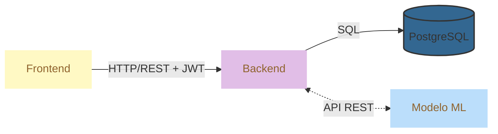

### LungLife - Diagnóstico temprano para el cáncer pulmonar.

#### **Problemática**

El cáncer es una enfermedad grave que puede invadir los órganos
vitales y en muchas ocasiones ser mortal, según las estadísticas, es la segunda
causa de muerte en Chile y a nivel mundial, sin embargo, un diagnóstico
temprano mejora considerablemente la expectativa de vida de las personas
afectadas por esta enfermedad. El machine Learning es de gran utilidad en el
diagnóstico precoz del cáncer, los sistemas que lo incorporan pueden «aprender»
sobre esta enfermedad y detectar una dolencia con la misma exactitud que un
médico y comenzar a tratar los síntomas de la enfermedad cuando antes, incluso
antes de que llegue a manifestarse.

#### Descripción General

El proyecto Lung Life surge como una respuesta tecnológica a la crítica situación
del cáncer pulmonar en Chile, siendo la primera causa de muerte por cáncer a
nivel nacional. Como una herramienta de salud digital, el sistema se enfoca en
el desarrollo de un Producto Mínimo Viable (MVP) que integra Machine Learning
para apoyar la detección temprana. Esta solución busca impactar positivamente
en la supervivencia de pacientes en estadios iniciales (Estadio I), donde la
intervención oportuna incrementa la probabilidad de éxito entre un 88% y 92%

#### Arquitectura del Sistema

### Arquitectura 3 Capas / 3-Tier Architecture

#### Frontend Mobile (Ionic + Angular Standalone)

- **Framework**: Ionic Framework con Angular Standalone Components
- **Lenguaje**: TypeScript
- **Estilos**: SCSS con sistema de temas
- **Patrón**: Clean Architecture con separación de capas  

#### Backend API (Node.js + TypeScript)

- **Framework**: Express.js con TypeScript
- **Base de Datos**: PostgreSQL local
- **Autenticación**: JWT con estrategias múltiples
- **Patrón**: Arquitectura en capas (Controllers → Services → Models)  

#### Base de Datos (PostgreSQL)

- **Tipo**: Base de datos relacional local
- **Esquemas**: Autenticación completa, perfiles de usuario, logs de auditoría
- **Migraciones**: Scripts SQL organizados  

#### Machine Learning (Python + CRISP-DM)

- **Metodología**: CRISP-DM (Cross Industry Standard Process for Data Mining)
- **Herramientas**: Jupyter Notebooks, Scikit-learn, Pandas
- **Visualización**: PowerBI para dashboards interactivos  

#### Atributos de Calidad

#### Mantenibilidad

- **Modularidad**: Arquitectura modular con feature modules
- **Clean Code**: Convenciones de nomenclatura consistentes
- **Documentación**: README, comentarios en código, documentación de API  

#### Usabilidad

- **Responsive Design**: Mobile-first con soporte cross-platform
- **UI Consistency**: Sistema de diseño unificado
- **User Feedback**: Estados de carga, mensajes de error, notificaciones  

#### Escalabilidad

- **Layered Architecture**: Separación clara de responsabilidades
- **Dependency Injection**: Inyección de dependencias para testing y flexibilidad
- **Microservices Ready**: Arquitectura preparada para migración a microservicios  

#### Confiabilidad

- **Error Handling**: Manejo robusto de errores en todas las capas
- **Logging**: Sistema de logging estructurado
- **Testing**: Tests unitarios e integración  

#### 

#### Jira Herramienta de Seguimiento SCRUM - Metodología Ágil

###### Fundamentación Estratégica

La implementación de Atlassian Jira como plataforma central de gestión ágil para el proyecto LungLife responde a la necesidad crítica de mantener trazabilidad completa, transparencia operacional, y alineación estratégica en un proyecto de desarrollo de  software. Jira se posiciona como la solución óptima debido a su arquitectura especializada para metodologías SCRUM, su capacidad de integración nativa con repositorios de código (GitHub), y su robusta funcionalidad de reporting y métricas ágiles esenciales para la toma de decisiones basada en datos.  

1. __Gestión Nativa de Artefactos SCRUM:__  

__Product Backlog:__ Organización jerárquica de Epics, Stories, y Tasks con priorización dinámica  
__Sprint Backlog:__ Planificación detallada con estimación en Story Points y capacidad de equipo  
__Sprint Board:__ Visualización Kanban en tiempo real (To Do, In Progress, Code Review, Done)  
__Burndown Charts:__ Monitoreo automático del progreso del sprint y velocity del equipo   

2. __Roles y Responsabilidades Definidas:__  

__Product Owner:__ Control total sobre backlog prioritization y acceptance criteria  
__Scrum Master:__ Dashboards especializados para identificar impedimentos y métricas de rendimiento  
__Development Team:__ Asignación transparente de tareas con tracking de tiempo y esfuerzo  

3. __Ceremonias SCRUM Optimizadas:__  

__Sprint Planning:__ Templates automatizados con estimación colaborativa y capacity planning  
__Daily Standups:__ Reportes automáticos de progreso y bloqueos identificados  
__Sprint Review:__ Documentación automática de deliverables y demo tracking
Retrospectives: Plantillas estructuradas para continuous improvement actions

#### Repositorio GitHub

El repositorio PTY4614 [Github-LungLife](https://github.com/secarvallo/PTY4614) constituye el núcleo de desarrollo colaborativo para el proyecto LungLife, una solución de App Mobile + Machine Learning enfocada en el diagnóstico temprano del cancer de pulmon. La elección de GitHub como plataforma de control de versiones se fundamenta en su robusta integración con herramientas de desarrollo modernas, capacidades avanzadas de CI/CD a través de GitHub Actions, y su ecosistema completo que incluye gestión de issues, pull requests, y wikis para documentación técnica. Esta plataforma facilita la colaboración entre equipos multidisciplinarios de desarrollo, proporcionando trazabilidad completa del código, versionado semántico, y controles de calidad esenciales para el proyecto de software.  

#### Estrategía de Branching

###### Flujo de Ramas de Publicación en GitHub

El flujo de publicación en GitHub sigue un patrón estructurado que garantiza la calidad y estabilidad del código. Inicia con la creación de ramas feature/ desde develop para nuevas funcionalidades, donde los desarrolladores implementan cambios específicos vinculados a tickets de Jira. Una vez completado el desarrollo, se crea un Pull Request (PR) hacia develop, donde se ejecutan automáticamente las pruebas de CI/CD, revisiones de código por pares y validaciones de calidad. Tras la aprobación y merge, los cambios se integran en develop para testing conjunto. Cuando se acumulan suficientes features, se crea una rama release/ que se somete a pruebas exhaustivas de QA antes de hacer merge a main/master para producción. En casos críticos, las ramas hotfix/ permiten correcciones directas desde main con despliegue inmediato. Este flujo asegura trazabilidad completa desde el desarrollo hasta producción, manteniendo la integridad del código y facilitando rollbacks cuando sea necesario.  
  

#### Principales Ramas de Trabajo LungLife

###### Ramas Principales

__main/master__    # Código en producción, versión estable  
__develop__        # Rama principal de desarrollo, integración continua  

1. __Ramas de Desarrollo de Funcionalidades__  
   __feature/LUNG-XXX-nombre__    # Nuevas funcionalidades con ticket Jira  
   __ml/experiment-name__         # Experimentos y modelos de machine learning  
   __refactor/component-name__    # Reestructuración y optimización de código  
2. __Ramas de Corrección y Mantenimiento__  
   __bugfix/LUNG-XXX-issue__     # Corrección de errores no críticos  
   __hotfix/LUNG-XXX-critical__  # Correcciones críticas urgentes en producción  
   __patch/LUNG-XXX-minor__      # Correcciones menores y ajustes rápidos  
   __maintenance/task-name__     # Tareas de mantenimiento y limpieza de código  
3. __Ramas de Interfaz de Usuario__  
   __ui/design-system-v2__       # Sistema de diseño, componentes reutilizables  
   __ux/user-journey-fix__       # Optimización de experiencia de usuario  
   __frontend/feature-name__     # Desarrollo específico de frontend   
4. __Ramas de Backend e Infraestructura__  
   __backend/api-endpoint__      # Desarrollo de APIs y lógica de servidor  
   __infra/aws-setup__          # Configuración de infraestructura(cloud,servidores)  
   __devops/pipeline-config__   # Automatización, CI/CD, contenedores   
5. __Ramas de Despliegue y Entornos__  
   __release/v1.2.0__           # Preparación de versiones para release  
   __deploy/staging-config__    # Configuración específica de despliegues  
   __config/environment-vars__  # Variables de entorno y configuraciones  
   __setup/development-env__    # Setup inicial de entornos de desarrollo   
6. __Ramas de Testing y Calidad__  
   __test/integration-suite__   # Tests automatizados e integración  
   __qa/regression-testing__    # Pruebas de calidad y regresión     
7. __Ramas de Documentación y Gestión__  
   __docs/api-documentation__   # Documentación técnica y de usuario  
   __github/workflow-setup__    # Configuración de GitHub (templates, actions)  
   __jira/automation-rules__    # Integración y automatización con Jira  
   __privacy/gdpr-compliance__  # Cumplimiento de privacidad y regulaciones   
