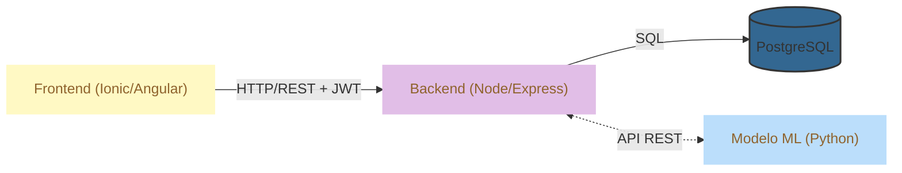

# LungLife - Diagnóstico Temprano para el Cáncer Pulmonar

Sistema integral de salud digital y Machine Learning para la detección temprana del cáncer de pulmón.

## Tabla de Contenidos

1. [Problemática](#problematica)
2. [Descripción General](#descripcion-general)
3. [Arquitectura del Sistema](#arquitectura-del-sistema)
4. [Requerimientos y Funcionalidades](#requerimientos-y-funcionalidades-atomizados)
5. [Stack Tecnológico](#stack-tecnologico)
6. [Instalación y Configuración](#instalacion-y-configuracion)
7. [Metodología de Trabajo](#metodologia-de-trabajo)
8. [Atributos de Calidad](#atributos-de-calidad)

---

## Problemática

El cáncer es una enfermedad grave que puede invadir los órganos vitales y en muchas ocasiones ser mortal. Según las estadísticas, es la segunda causa de muerte en Chile y a nivel mundial. Sin embargo, un diagnóstico temprano mejora considerablemente la expectativa de vida de las personas afectadas por esta enfermedad.

El **Machine Learning** es de gran utilidad en el diagnóstico precoz del cáncer; los sistemas que lo incorporan pueden «aprender» sobre esta enfermedad y detectar una dolencia con la misma exactitud que un médico, permitiendo comenzar a tratar los síntomas cuanto antes, incluso antes de que lleguen a manifestarse clínicamente.

## Descripción General

El proyecto **Lung Life** surge como una respuesta tecnológica a la crítica situación del cáncer pulmonar en Chile, siendo la primera causa de muerte por cáncer a nivel nacional. 

Como herramienta de salud digital, el sistema se enfoca en el desarrollo de un **Producto Mínimo Viable (MVP)** que integra Machine Learning para apoyar la detección temprana. Esta solución busca impactar positivamente en la supervivencia de pacientes en estadios iniciales (Estadio I), donde la intervención oportuna incrementa la probabilidad de éxito entre un **88% y 92%**.

---

## Arquitectura del Sistema

El sistema utiliza una **Arquitectura en 3 Capas (3-Tier Architecture)** robusta y desacoplada, diseñada para escalabilidad y mantenibilidad.



---

## Requerimientos y Funcionalidades (Atomizados)

El sistema se compone de módulos funcionales claramente definidos:

### Módulo de Autenticación y Seguridad
- [x] **Registro de Usuarios**: Permite a pacientes y especialistas crear cuentas seguras.
- [x] **Login Seguro**: Autenticación mediante **JWT (Json Web Tokens)**.
- [ ] **Recuperación de Contraseña**: Flujo seguro para restablecer credenciales.
- [ ] **Gestión de Sesiones**: Manejo de Refresh Tokens y expiración de sesiones.

### Módulo de Usuario
- [ ] **Perfil de Usuario**: Gestión de información personal y antecedentes médicos.
- [ ] **Dashboard Principal**: Vista resumen del estado de salud y últimas evaluaciones.
- [ ] **Historial Médico**: Registro de evaluaciones previas y resultados.

### Módulo de Diagnóstico (Machine Learning)
- [ ] **Evaluación de Síntomas**: Formulario interactivo para ingreso de sintomatología.
- [ ] **Predicción de Riesgo**: Procesamiento de datos mediante modelos de ML (CRISP-DM).
- [ ] **Resultados Interpretables**: Visualización clara del nivel de riesgo detectado.

### Módulo de Administración (Backend)
- [x] **API RESTful**: Endpoints documentados para todas las operaciones.
- [x] **Validación de Datos**: Uso de `Zod` y `Validator` para integridad de datos.
- [ ] **Logs de Auditoría**: Registro de actividades críticas del sistema.

---

## Stack Tecnológico

### Frontend Mobile
- **Framework**: Ionic Framework v8 + Angular v19 (Standalone Components).
- **Lenguaje**: TypeScript.
- **Estilos**: SCSS, Diseño Responsivo.
- **Testing**: Playwright (E2E), Jasmine/Karma (Unit).

### Backend API
- **Runtime**: Node.js.
- **Framework**: Express.js.
- **Lenguaje**: TypeScript.
- **Seguridad**: Bcrypt, JWT, Helmet.
- **Validación**: Zod.
- **Documentación**: Swagger/OpenAPI.

### Base de Datos
- **Motor**: PostgreSQL.
- **Gestión**: Scripts SQL nativos y migraciones controladas.

### Machine Learning
- **Metodología**: CRISP-DM.
- **Lenguaje**: Python 3.x.
- **Librerías**: Pandas, Scikit-learn, XGBoost.
- **Entorno**: Jupyter Notebooks.

---

## Instalación y Configuración

Sigue estos pasos para levantar el entorno de desarrollo local.

### Prerrequisitos
- Node.js (v18+)
- Python (v3.9+)
- PostgreSQL (Local o Docker)
- Ionic CLI (`npm install -g @ionic/cli`)

### 1. Configuración del Backend

```bash
cd LungLife/lunglife_backend
npm install
# Crear archivo .env basado en .env.example
npm run dev
```

### 2. Configuración del Frontend

```bash
cd LungLife/lunglife_frontend
npm install
ionic serve
```

### 3. Configuración de Machine Learning

```bash
cd LungLife/lunglife_ml/crisp_dm
pip install -r requirements.txt
# Ejecutar notebooks o scripts en /src
```

---

## Metodología de Trabajo

### Gestión Ágil (Jira + Scrum)
Utilizamos Jira para la gestión transparente del ciclo de vida del desarrollo:
*   **Product Backlog**: Historias de usuario priorizadas.
*   **Sprints**: Ciclos iterativos de desarrollo.
*   **Roles**: Product Owner, Scrum Master, Dev Team.

### Control de Versiones (Git Flow)
Estrategia de ramas para garantizar estabilidad:
*   `main`: Código estable en producción.
*   `develop`: Rama de integración principal.
*   `feature/`: Nuevas funcionalidades (ej. `feature/LUNG-101-login`).
*   `bugfix/`: Corrección de errores.
*   `release/`: Preparación para despliegue.

---

## Atributos de Calidad

*   **Mantenibilidad**: Código modular, tipado estático (TypeScript) y Clean Architecture.
*   **Escalabilidad**: Separación de responsabilidades y diseño API First.
*   **Seguridad**: Encriptación de datos sensibles y protección contra vulnerabilidades web comunes.
*   **Usabilidad**: Diseño centrado en el usuario (Mobile-First).

---

<footer>
  <p>Desarrollado con ❤️ por WhiteRabbit DS © 2026</p>
</footer>
