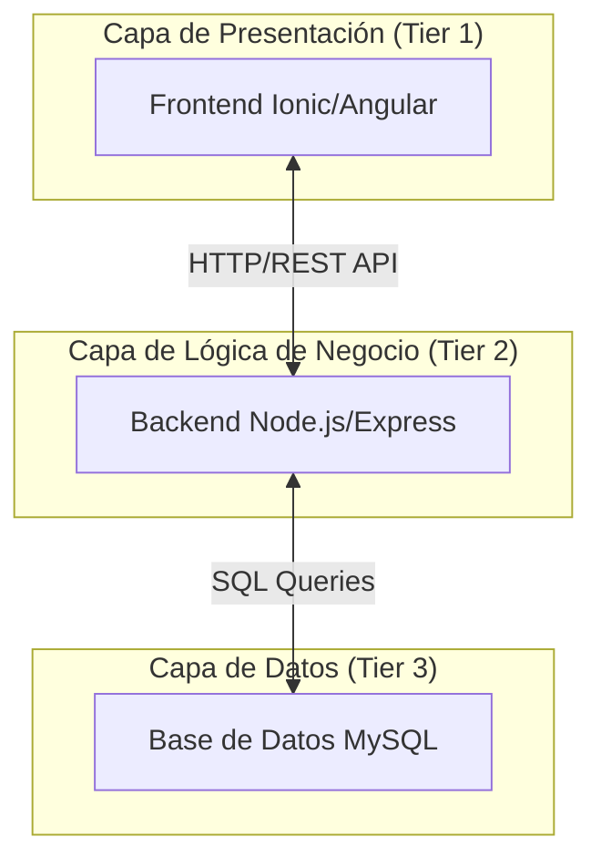
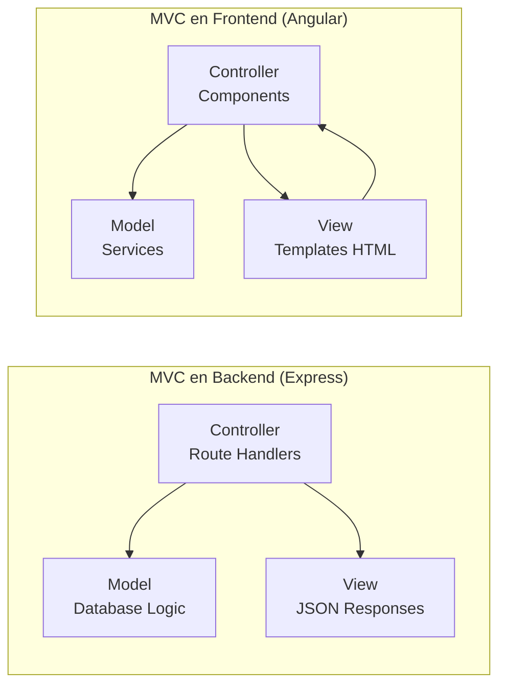
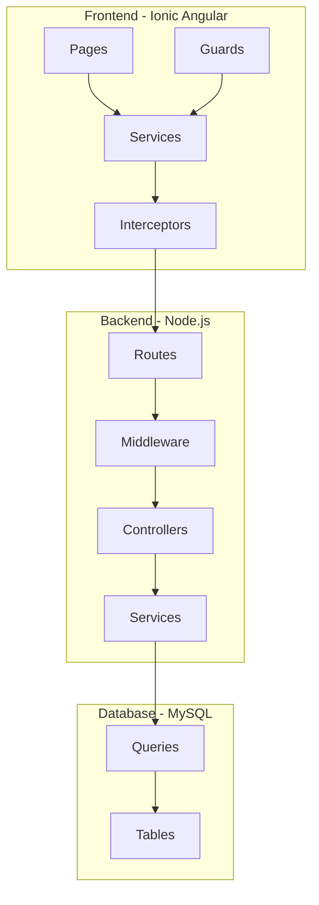
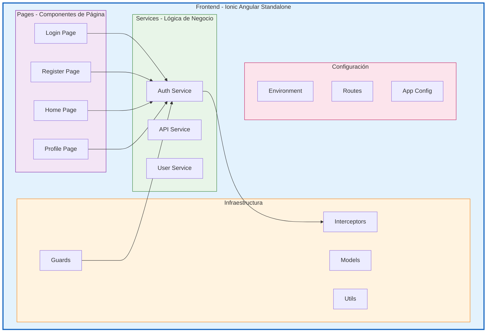

# LungLife - App de Salud Movil

# Proyecto diagnóstico temprano de Cáncer

### Contexto

El cáncer pulmonar representa una de las formas más prevalentes y letales de cáncer a nivel global, caracterizado por el crecimiento descontrolado de células anormales en los pulmones que pueden invadir tejidos adyacentes y metastatizar a otros órganos vitales, lo que frecuentemente resulta en un desenlace fatal si no se detecta a tiempo. Según estadísticas recientes, el cáncer pulmonar es el cáncer más comúnmente diagnosticado en el mundo, representando el 12.4% de todos los casos de cáncer, y es la principal causa de muerte por cáncer en hombres en varios países de América Latina, incluyendo Chile, donde se proyecta una tasa de mortalidad de 12.0 por 100.000 habitantes para 2025. En Chile, el cáncer en general registra una incidencia anual de aproximadamente 59.876 casos y 31.440 muertes, con el cáncer pulmonar destacando como una de las principales causas, influenciado por factores como el tabaquismo, la exposición ambiental a contaminantes y predisposiciones genéticas. A nivel mundial, se estima que alrededor de 2.2 millones de personas son diagnosticadas anualmente con cáncer pulmonar, siendo la segunda causa de muerte en mujeres y la primera en hombres en muchas regiones. Sin embargo, un diagnóstico temprano puede elevar la tasa de supervivencia del 15-20% en etapas avanzadas a más del 50-60% en fases iniciales, permitiendo intervenciones oportunas como cirugía, quimioterapia o radioterapia.

### Problema

El cáncer es una enfermedad grave que puede invadir los órganos vitales y en muchas ocasiones ser mortal, según las estadísticas, es la segunda causa de muerte en Chile y a nivel mundial, sin embargo, un diagnóstico temprano mejora considerablemente la expectativa de vida de las personas afectadas por esta enfermedad.
El machine learning es de gran utilidad en el diagnóstico precoz del cáncer, los sistemas que lo incorporan pueden «aprender» sobre esta enfermedad y detectar una dolencia con la misma exactitud que un médico y comenzar a tratar los síntomas de la enfermedad cuando antes, incluso antes de que llegue a manifestarse.

# Aplicacion movil hibrida para diagnostico temprano de cancer pulmonar

### Stack

[Angular 20]([What is Angular? • Angular](https://angular.dev/overview))

[Ionic 8](https://ionicframework.com/docs) 

[Node.js 22.20.0]([Node.js — Descarga Node.js®](https://nodejs.org/es/download))

[PostgreSQL 18]([PostgreSQL: Documentation: 18: PostgreSQL 18.0 Documentation](https://www.postgresql.org/docs/18/index.html))

[TypeScript](https://www.typescriptlang.org/docs/)

### Arquitectura 3 Capas / 3-Tier Architecture

##### **CARACTERÍSTICAS DE CADA CAPA**

##### CAPA 1: PRESENTACIÓN (Frontend)

| **Característica**  | **Implementación**       | **Tecnología**  |
| ------------------- | ------------------------ | --------------- |
| **Responsabilidad** | Interfaz de usuario      | Ionic + Angular |
| **Comunicación**    | HTTP/REST API            | HttpClient      |
| **Estado**          | Estado local del cliente | LocalStorage    |
| **Renderizado**     | Client-side rendering    | Angular Router  |

##### CAPA 2: LÓGICA DE NEGOCIO (Backend)

| **Característica**  | **Implementación**               | **Tecnología**        |
| ------------------- | -------------------------------- | --------------------- |
| **Responsabilidad** | Reglas de negocio, autenticación | Node.js + Express     |
| **Comunicación**    | Endpoints REST                   | Express Routes        |
| **Procesamiento**   | Validación, lógica de negocio    | JavaScript/TypeScript |
| **Seguridad**       | JWT, hash contraseñas            | JWT, bcrypt           |

##### CAPA 3: PERSISTENCIA DE DATOS (Database)

| **Característica**  | **Implementación**         | **Tecnología**  |
| ------------------- | -------------------------- | --------------- |
| **Responsabilidad** | Almacenamiento persistente | MySQL           |
| **Comunicación**    | Consultas SQL              | MySQL2 driver   |
| **Estructura**      | Modelo relacional          | Tablas, índices |
| **Integridad**      | Transacciones ACID         | MySQL engine    |

##### PATRONES DE DISEÑO UTILIZADOS

1. ##### MVC (Model-View-Controller) - Adaptado

[Arquitectura 3 Niveles]([¿Qué es la arquitectura de tres niveles? | IBM](https://www.ibm.com/mx-es/think/topics/three-tier-architecture))

## Estructura del Proyecto

### Frontend (lunglife_frontend)

- Angular 20 con componentes standalone
- Ionic 8 para interfaz movil
- TypeScript 5.8

### Backend (lunglife_backend)

- Node.js + Express.js
- TypeScript 5.1
- API REST
- Autenticacion JWT con 2FA

### Base de Datos (lunglife_bd)

- PostgreSQL con extensiones
- Schema normalizado
- Sistema de auditoria automatico

### Dependencias

`npm install`

## Arquitectura

frontend/src/app/
├── pages/          # Componentes de página
├── services/       # Lógica de aplicación frontend
├── guards/         # Control de acceso a rutas
├── interceptors/   # Interceptores HTTP
├── models/         # Tipos e interfaces
└── environments/   # Configuración

### Diagrama de Estrucutrra Frontend

# 